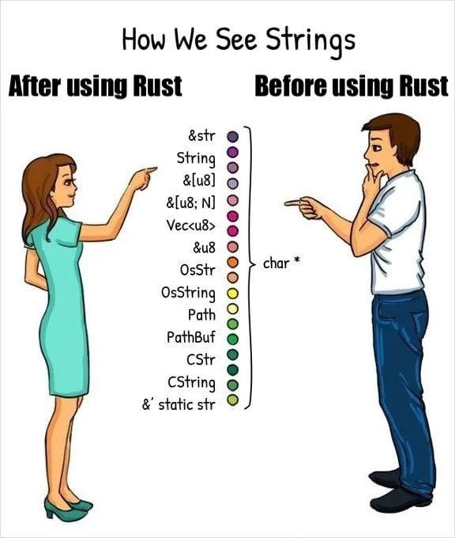

### 为Rust有很多字符串类型而烦恼吗？好吧，它没有必要 

> 众所周知Rust有几种不同的字符串类型。两个主要的竞争者是：
> 
>  - `&str`是一个 "字符串引用"。它是不可调整大小的，它的可变性是有限的。
>  - `String`是一个 “自有（owned）字符串"。它是可调整大小的，并且可以简单地被改变。
> 
> 事实证明，这两个字符串并没有太大区别。
> `str`只是一个由`[u8]`字节片支持的字符串。
> 同样地，`String`只是一个[由`Vec<u8>`支持的字符串](https://github.com/rust-lang/rust/blob/88e5ae2dd3/library/alloc/src/string.rs#L294-L296)。
> 
> 那么为什么它们真的是不同的类型呢？理论上我们不能有这样的东西吗：
> 
> ``rust
> type str = StringBase<[u8]>;
> type String = StringBase<Vec<u8>>;
> ```
> 
> 所以，就是这一点。这主要是为了与标准库中的字符串进行功能比对。很多标准`trait`的实现，这里也实现了。
> 
> 我还实现了
> 
> ``rust
> type str32 = StringBase<[char]>;
> type String32 = StringBase<Vec<char>>;
> ```
> 
> 用于utf-32应用程序。

顺便贴上这个万恶的表情包：



[Github](https://github.com/conradludgate/generic-str): https://github.com/conradludgate/generic-str

### Redox OS（以及类似的项目）计划如何处理缺乏动态链接支持的问题？

> 几天前，我问是否有人对C FFI之外的二进制库发行有什么建议，人们不断地给我指出各种 "hack "解决方案，对此我非常感激（尽管这些hack的方法在我的特定情况下没有帮助，C FFI看起来仍然是最不坏的解决方案）。
> 
> 然而，有一件事让我很吃惊，那就是动态链接（或者说是可预测的ABI，我认为动态链接需要ABI）的想法（也许只是被认为）受到了反对。还有一个事实是，几乎没有人关心在我看来是系统语言设计中的一个巨大漏洞。
> 
> TL;DR：
> 
> 这让我想到：Redox OS或类似的项目（比如今天早些时候[u/dptzippy发布的项目](https://www.reddit.com/r/rust/comments/qr2kyb/libertyos_another_opensource_operating_system/)）打算如何解决这个问题？他们肯定不会期望人们在某个核心库/缓存中的错误修复后重新编译整个操作系统，或者他们会怎样做？还是我错过了什么？
> 
> *我说的是 "可预测 "而不是 "稳定"，因为我们不需要一个完全稳定的ABI。即使只是保证如果我用同一版本的编译器编译东西，如果公共API保持不变，公共ABI也会有很大的帮助。

今日reddit上的Rust板块的热帖，贴一下高赞回复：

> 你好，我是[`Theseus`](https://github.com/theseus-os/Theseus)操作系统的作者。很好的帖子，真的和我心底的想法一致。
> 
> 缺乏一个稳定的ABI是我们尚未完全解决的一个大障碍。这个问题对于像 `Theseus` 这样基于安全语言的 SAS/SPL 操作系统来说特别重要，考虑到我们的目标是让编译器对系统各层的所有代码都能可见（`visibility`）/自我反省（`instrospection`），没有盲点，就更重要了。我个人认为，对于使用系统调用作为用户应用程序和内核之间的 "稳定 "接口的其他操作系统来说，这不是一个问题，或者在更广泛的意义上，作为两个独立编译的代码片断之间的 "稳定 "连接层，它们在执行时相互依赖。
> 我记录了我在实现针对现有 `Theseus` 编译实例为了编译`out-of-tree`这个`crate`（以及一个各种启动器 libc 骨架）的工具时所经历的历程和思考过程。这涉及到对`cargo`的hack式滥用，我没必要推荐其他用例 -- 在我们有限的事例下，它是有效的，因为我们可以控制一切的编译 -- 但相当难以处理。它很可能无法扩展到支持闭源应用程序或库的分发。显然，我意识到，在运行时动态地重新链接单独编译的二进制文件中的符号/依赖关系是非常愚蠢和乏味的，这些符号/依赖关系在构建时是静态链接的，与实际运行的系统实例中存在的这些依赖关系的版本相一致。请注意，我们还没有时间去探索更好的选择。我发这个帖子只是为了说明人们为了解决稳定的ABI问题而可能需要做的事情。
> 
> 最好的 "替代方案 "基本上是其他人在你上面链接的u/dptzippy的帖子中所建议的—使用某种`bindgen`来创建一个薄的FFI层，将稳定的C ABI函数作为Rust函数的存根来暴露。然而，这有一个主要的缺点，那就是到处引入不必要的`unsafe`因素，这有点违反了我上面提到的`Theseus`的整个目标，因为`unsafe`因素是一个盲点。
> 
> 不管怎么说，我只是觉得应该把我的想法说出来，在这里分享我的经验，让对话进行下去，看看其他人有什么意见。

[Read More](https://www.reddit.com/r/rust/comments/qr5pyo/how_is_redox_os_and_similar_projects_planning_to/): https://www.reddit.com/r/rust/comments/qr5pyo/how_is_redox_os_and_similar_projects_planning_to/
### 异步取消（asnyc cancellation）
> 有时我们开始做事情，但中途决定宁愿不做这些事情。这个过程有时被称为 "取消"。比如我们不小心在浏览器中点击了 "下载 "一个大文件。我们应该有办法告诉计算机停止下载它。
> 
> 今年早些时候，当Rust异步工作组在研究用户体验时，异步取消被反复提及。这是一种很重要的东西，但推理起来却很麻烦。我想我可以通过写一篇关于这个主题的深度研究来改变这种状况。
> 
> 在这篇文章中，我们将看一下`Async Rust`的异步原语，并介绍今天这些原语的取消是如何进行的。然后，我们将继续研究如何确保我们不会出现资源悬空的情况。最后，我们将看看当前`Async Rust`的方向对`Async取消`意味着什么。听起来像个计划？很好，让我们开始行动吧

技术向博文。

[Read More](https://blog.yoshuawuyts.com/async-cancellation-1/): https://blog.yoshuawuyts.com/async-cancellation-1/

### 保持冷静，学习Rust。我们很快就会在Linux中更多的看到这种语言。
 > 要成为一名Linux开发者，你曾经需要C语言作为你的护照。现在Rust也可以让你成为一个操作系统程序员。
 > 
 > 有这样一个笑话。"C语言结合了汇编语言的力量和性能以及汇编语言的灵活性和易用性"。我曾经用C语言和IBM 360汇编语言编程--那是很久以前的事了，好吧--这话是有道理的。由于C语言的功能、性能和可移植性，它成为操作系统语言的首选，当然也包括Linux。

 一篇博文，介绍Rust在Linux中的应用。

 [Read More](https://www.theregister.com/2021/11/10/where_rust_fits_into_linux/): https://www.theregister.com/2021/11/10/where_rust_fits_into_linux/

### 本周周报

> 即使你能修复rustc的所有健全性漏洞，或者以其他方式防止用户代码利用这些漏洞，任何第三方库中的健全性漏洞也会使恶意的crates有可能从安全代码中触发任意行为。
>
> [...]
>
> 这就是为什么我们需要强调，虽然Rust的静态分析在限制非恶意代码的意外漏洞方面非常出色，但它们并不是一个可以对恶意代码进行有意义限制的沙盒系统。

- [Matt Brubeck 在 rust-users 谈到](https://users.rust-lang.org/t/regarding-the-security-safety-of-libraries-on-crates-io/66294/24)

[Read More](https://this-week-in-rust.org/blog/2021/11/10/this-week-in-rust-416/): https://this-week-in-rust.org/blog/2021/11/10/this-week-in-rust-416/

### 最后

这个月的游戏月报，有不少很好的作品，关注Rust游戏开发的小伙伴，别忘了去看月报！

[Read More](https://gamedev.rs/news/027/): https://gamedev.rs/news/027/

From 日报小组 Cupnfish

社区学习交流平台订阅：

- [Rust.cc 论坛: 支持 rss](https://rustcc.cn/)
- [微信公众号：Rust 语言中文社区](https://rustcc.cn/article?id=ed7c9379-d681-47cb-9532-0db97d883f62)
