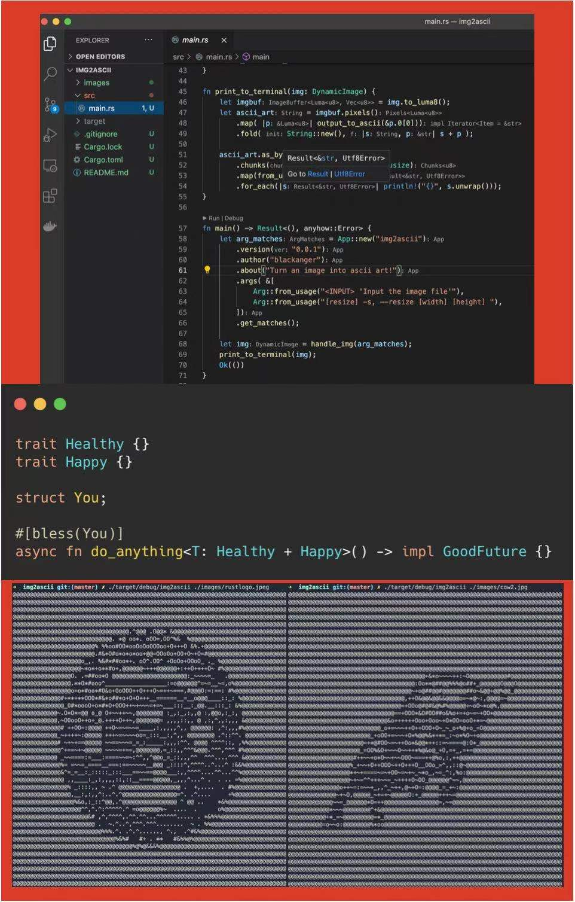

### Rust 牛气冲天！
rust中文论坛日报小组祝愿大家：

新的一年，万事随想，所爱如山。

张汉东老师70行 Rust 代码祝大家新春健康快乐，祝 Rust 牛气冲天！



源码在这：https://github.com/ZhangHanDong/2021soaring

### Rust stable 1.50 发布！

Rust stable 1.50 版本在今天发布了，你可以通过以下命令升级你的Rust版本：
```shell
rustup update stable
```
关于1.50这个版本，改进了数组索引，扩展了对联合字段的安全访问，并添加到标准库中。请参阅详细的[发布说明](https://github.com/rust-lang/rust/blob/master/RELEASES.md#version-1500-2021-02-11)（https://github.com/rust-lang/rust/blob/master/RELEASES.md#version-1500-2021-02-11） ，了解更多信息。

[Read More](https://blog.rust-lang.org/2021/02/11/Rust-1.50.0.html): https://blog.rust-lang.org/2021/02/11/Rust-1.50.0.html

### 比较 Rust `async` 与 Linux 线程上下文切换时间

作者写了一些代码，试图比较 Linux 线程上下文切换所需时间和Rust `async`任务调度切换所需时间及其各自在使用时的内存使用总量，并且还做出了总结。

[Github](https://github.com/jimblandy/context-switch): https://github.com/jimblandy/context-switch


### Yatta: 用于 Windows10 的 BSP 平铺窗口管理器

作者最近因为从之前的mac环境由于一些原因需要切换到windows环境下工作，但是没有找到之前使用mac时的桌面分割工具（窗口排放管理工具），于是自己花了几天，研究了不少其它类似的工具，捣鼓出了这个。


[Github](https://github.com/LGUG2Z/yatta): https://github.com/LGUG2Z/yatta

### colorgrad-rs 一个用rust编写的颜色标尺库

你可以用这个crate构建很漂亮的图标，将你的数据可视化。
示例：
渐变：
```rust
let g = colorgrad::CustomGradient::new().build()?;
```

自定义颜色的渐变：
```rust
use colorgrad::Color;

let g = colorgrad::CustomGradient::new()
    .colors(&[
        Color::from_rgb_u8(0, 206, 209),
        Color::from_rgb_u8(255, 105, 180),
        Color::from_rgb(0.274, 0.5, 0.7),
        Color::from_hsv(50., 1., 1.),
        Color::from_hsv(348., 0.9, 0.8),
    ])
    .build()?;
```


更多示例请直接查看该项目 github 主页：

[Github](https://github.com/mazznoer/colorgrad-rs): https://github.com/mazznoer/colorgrad-rs


### This Week in Rust 377

377。

[Read More](https://this-week-in-rust.org/blog/2021/02/10/this-week-in-rust-377/)：https://this-week-in-rust.org/blog/2021/02/10/this-week-in-rust-377/


From 日报小组 Cupnfish Jancd

社区学习交流平台订阅：

- [Rust.cc 论坛: 支持 rss](https://rustcc.cn/)
- [微信公众号：Rust 语言学习交流](https://rustcc.cn/article?id=ed7c9379-d681-47cb-9532-0db97d883f62)