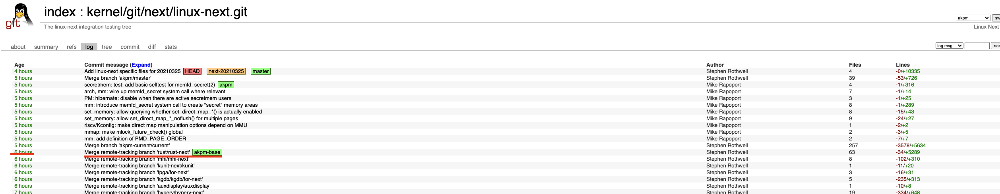

### linux-next的rust-next分支被合并了




### Flume 一个安全快速的多生产者多消费者通道实现

简单示例：
```rust
use std::thread;

fn main() {
    println!("Hello, world!");

    let (tx, rx) = flume::unbounded();

    thread::spawn(move || {
        (0..10).for_each(|i| {
            tx.send(i).unwrap();
        })
    });

    let received: u32 = rx.iter().sum();

    assert_eq!((0..10).sum::<u32>(), received);
}
```
#### 为什么选择 Flume?

- **功能丰富**: Unbounded, bounded 和 rendezvous 队列
- **快速**: 通常比 `std::sync::mpsc` 更快，某些情况比 `crossbeam-channel` 更快
- **安全**: 代码库中没有使用任何的 `unsafe` ！ 
- **灵活**: `Sender` 和 `Receiver` 同时支持 `Send + Sync + Clone`
- **熟悉**: 几乎和 `std::sync::mpsc`的用法一致
- **更多功能**: 比如 MPMC 支持和发送 timeouts/deadlines 
- **简单**: 足够小的依赖, 足够小的代码, 足够少的编译时间
- **异步**:  `async`支持
- **人体工程学**: 强大的类似`select`的接口

Github主页上还有benchmark：

[Github](https://github.com/zesterer/flume): https://github.com/zesterer/flume


### uwu-tray 颜文字跨平台托盘应用程序
前两天日报报道的颜文字生成工具的托盘应用程序，目前仅支持Windows平台的托盘，计划是跨平台的托盘应用程序，有对Rust语言GUI开发感兴趣的可以关注一下代码实现。


[Github](https://github.com/Olaren15/uwu-tray) ：https://github.com/Olaren15/uwu-tray

### task-stream 一个能运行在`no_std`的全局异步任务spawner

`task-stream`是一个全局任务spawner，可以在`no_std`中运行。

它提供了用于异步任务的spawner，以及异步延迟函数。

它是为库作者设计的。 在第三方库中，可以生成子任务，而无需关心执行程序主程序使用的子任务。

基本用法：
```rust
fn test_sync_fun() {
    fn sync_task() {
        println!("sync_task.");
    }
    task_stream::spawn(async {
        sync_task();
    });
}
fn test_async_fun() {
    async fn async_task() {
        println!("async_task.");
    }
    task_stream::spawn(async_task());
}
fn test_capture_var() {
    let a: usize = 1;
    task_stream::spawn(async move {
        println!("catch a: {}.", a);
    });
}
fn test_sleep() {
    task_stream::spawn(async move {
        let mut now: u64 = 0;
        loop {
            println!("now: {}.", now);
            task_stream::sleep(Duration::from_millis(1000)).await;
            now += 1000;
        }
    });
}
```

更多示例请查看以下链接内容：

[crates.io](https://crates.io/crates/task-stream) ：https://crates.io/crates/task-stream

### permit 一个用于取消操作的结构体。

#### 使用场景
 - 优雅的关闭服务
 - 取消耗时太长的操作
 - 在撤销授权时停止运行中的操作

示例：
```rust
let top_permit = permit::Permit::new();
// Start some worker threads.
for _ in 0..5 {
    let permit = top_permit.new_sub();
    std::thread::spawn(move || {
        while !permit.is_revoked() {
            // ...
        }
    });
}
wait_for_shutdown_signal();
// Revoke all thread permits.
top_permit.revoke();
// Give the threads time to finish
// and drop their permits.
let _ = top_permit.try_wait_for(
    core::time::Duration::from_secs(3));
```

[Read More](https://crates.io/crates/permit)： https://crates.io/crates/permit

### 功能齐全的FM合成器运行在浏览器上!


该程序使用Rust编写，编译到WebAssembly，运行在浏览器上。

比较有意思的点是编译的WebAssembley是支持SIMD的，作者在blog里有相关介绍。

[在线地址](https://notes.ameo.design/fm.html): https://notes.ameo.design/fm.html

[Read More](https://cprimozic.net/blog/fm-synth-rust-wasm-simd/): https://cprimozic.net/blog/fm-synth-rust-wasm-simd/

### pico-args 一个非常简单的命令行参数解析器

与相关替代品的建议比较：

- [clap](https://crates.io/crates/clap) - 最受欢迎同时功能最全的
- [gumdrop](https://crates.io/crates/gumdrop) - 一个简单的使用过程宏的解析器
- [structopt](https://crates.io/crates/structopt) - 上面两个的缝合体
- [argh](https://crates.io/crates/argh) - 类似于 `gumdrop`

|                        | null    | `pico-args` | `clap`   | `gumdrop` | `structopt` | `argh`  |
|------------------------|---------|-------------|----------|-----------|-------------|---------|
| 二进制开销 | 0KiB    | **14.3KiB** | 373.0KiB | 19.8KiB   | 371.4KiB    | 17.6KiB |
| 编译时间 | 0.4s    | **0.7s**    | 5.6s     | 4.1s      | 6.2s        | 4.0s    |
| 依赖数量 | 0       | **0**       | 8        | 5         | 20          | 8       |
| 测试版本 | -       | 0.4.0       | 2.33.3   | 0.8.0     | 0.3.21      | 0.1.4   |


[Github](https://github.com/RazrFalcon/pico-args)：https://github.com/RazrFalcon/pico-args

### This Week in Rust 383

383。

[Read More](https://this-week-in-rust.org/blog/2021/03/24/this-week-in-rust-383/)：https://this-week-in-rust.org/blog/2021/03/24/this-week-in-rust-383/

感谢张汉东老师（@AlexZhang）和坏姐姐（@huangjj27）提供的讯息

From 日报小组 Cupnfish Jancd

社区学习交流平台订阅：

- [Rust.cc 论坛: 支持 rss](https://rustcc.cn/)
- [微信公众号：Rust 语言中文社区](https://rustcc.cn/article?id=ed7c9379-d681-47cb-9532-0db97d883f62)