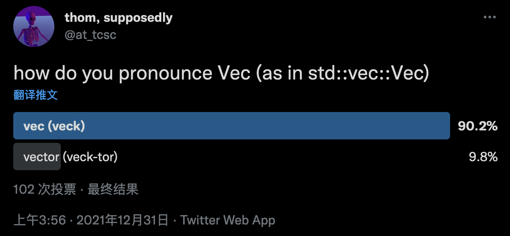

### 【博文】把`include_dir`带入现代 

[`include_dir`](https://crates.io/crates/include_dir)这个crate提供了一个`include_dir!()`宏，用于在编译时将整个目录树嵌入你的二进制文件中。这就像`include_str!()`，但针对整个目录。

我最近做了大量的工作来改善这个crate，增加了想要的功能，改善了编译时间，并巩固了它的核心目标，所以我觉得有必要进行项目更新。

我也想利用这篇博文作为一个机会，征求大家的评论。如果有更多的人关注这个crate，那将是非常好的，而使用像[CREV](https://web.crev.dev/rust-reviews/)这样的公共审查系统会让人们更有信心在生产中使用`include_dir`。你可以查看[入门指南](https://github.com/crev-dev/cargo-crev/blob/master/cargo-crev/src/doc/getting_started.md)以了解更多。

[Read More](https://adventures.michaelfbryan.com/posts/bringing-include_dir-into-the-modern-era/?utm_source=reddit&utm_medium=social&utm_campaign=modern-include-dir): https://adventures.michaelfbryan.com/posts/bringing-include_dir-into-the-modern-era/?utm_source=reddit&utm_medium=social&utm_campaign=modern-include-dir

### 我的第一个Rust应用，git智能签出，模糊搜索分支，我有点喜欢这门语言❤️🦀 

作者的第一个Rust项目，发了一个帖子，热评帮忙做了代码review，给出了一些建议。

我记性不是很好，因此平时做了一些笔记。

这是一些小建议，在你将来写Rust时应该会有帮助。

- https://github.com/craciuncezar/git-smart-checkout/blob/main/src/git_client.rs#L7 这些都可以只是函数。Rust不是OOP，所以如果你不需要状态，不需要用结构把所有这些东西绑定在一起也是可以的。

- 对于`GitBranch`，你可以只需要`[derive(Clone)]`而不是自己实现它。https://github.com/craciuncezar/git-smart-checkout/blob/main/src/git_client/git_branch.rs#L4 参考文献：https://doc.rust-lang.org/rust-by-example/trait/derive.html

- 在Rust中，如果你能在可能的情况下将`clone`给调用者负责，而不是自己去做，那是最好的，在 https://github.com/craciuncezar/git-smart-checkout/blob/main/src/git_client/utils.rs#L3 ，我认为`to_vec`在底层做了一个`clone`。我的意思是，如果你需要某个东西的明确拷贝，就用所有权而不是引用，但让调用者决定他是想给你所有权还是克隆这个值给你。

- 在这个只在一个地方使用的`fn`的具体案例中，我认为你一般不需要它，但如果你要在多个地方使用它，你可以把`Vec`传成可变的，并立即排序，不需要`clone`。你也可以将`Vec<GitBranch>`包装成一个新的类型，并为其实现`fn` https://rust-unofficial.github.io/patterns/patterns/behavioural/newtype.html。

- 你的模块和类型的另一种构造可以是`git`、`git::client`、`git::client::switch_to_branch`、`git::Branch`。

- 当把一个`Vec`引用传递给一个函数时，通常作为切片接收：`branches: &[GitBranch]`更方便。调用代码保持不变，但现在可以传递数组以及`Vec`去调用该函数。通常情况下，`String`和`&str`也是如此。

- 我看到你有很多的`unwrap`。我建议是试一下[`anyhow`](https://docs.rs/anyhow/latest/anyhow/)。你会发现错误处理会变的容易。

[Read More](https://libreddit.spike.codes/r/rust/comments/rwwa35/media_my_first_rust_app_git_smart_checkout_fuzzy/): https://libreddit.spike.codes/r/rust/comments/rwwa35/media_my_first_rust_app_git_smart_checkout_fuzzy/

另外本帖作者提到[《Rust设计模式（Rust Design Patterns）》](https://rust-unofficial.github.io/patterns/)这本书，感兴趣的也可以看看。

### 本周周报

> 我在twitter上进行了一次极其科学的民意调查，并确定这不是它的发音: https://twitter.com/at_tcsc/status/1476643344285581315
> 
> 
>
> 确实, 它本质上是一个`Vec<T, A>`， 发音为 `Veck-tah`。 😛
> 
> 听着，我搬离波士顿是为了避免这类事情😆。

-[the8472 和 Thom Chiovoloni 在 github 上评论](https://github.com/rust-lang/rust/pull/92463#discussion_r777059401)

[Read More](https://this-week-in-rust.org/blog/2022/01/05/this-week-in-rust-424/): https://this-week-in-rust.org/blog/2022/01/05/this-week-in-rust-424/

From 日报小组 Cupnfish

社区学习交流平台订阅：

- [Rust.cc 论坛: 支持 rss](https://rustcc.cn/)
- [微信公众号：Rust 语言中文社区](https://rustcc.cn/article?id=ed7c9379-d681-47cb-9532-0db97d883f62)